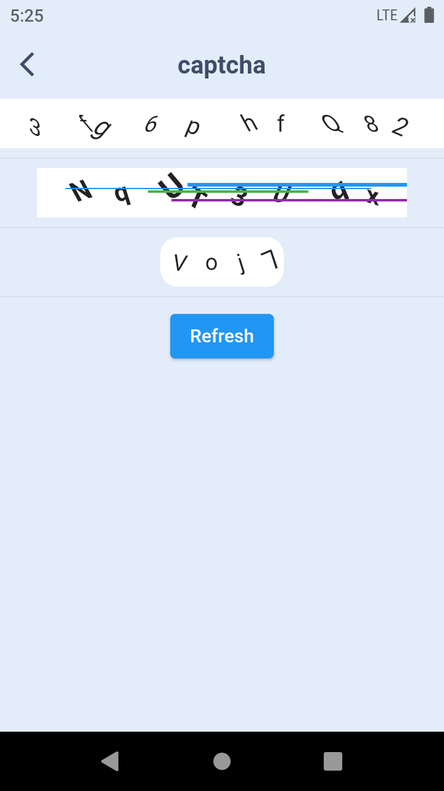

# captcha_view


```dart
Captcha(
      {Key key,
      this.width = double.infinity,
      this.height = 40,
      this.backgroundColor = Colors.white,
      this.style = const TextStyle(fontSize: 18),
      this.text = '',
      this.lineColors,
      this.decoration = const BoxDecoration(
        color: Colors.white,
      )}) : super(key: key);
```

Usage:

```
Captcha(
    text: Captcha.generateText(length: 10,withLetter: true,withNumber: true),
)
```

```
Captcha(
  lineColors: null,
  text: Captcha.generateText(length: 4,withLetter: true,withNumber: true),
  width: 100,
  decoration: BoxDecoration(
    color: Colors.white,
    borderRadius: BorderRadius.circular(14)
  ),
)
```

```
Captcha(
  lineColors: Captcha.rainbowColors,
  text: Captcha.generateText(length: 8,withLetter: true,withNumber: true),
  width: 300,
  style: TextStyle(
    fontSize: 20,
    fontWeight: FontWeight.bold
  ),
)
```

Screenshot_1611307510.png
