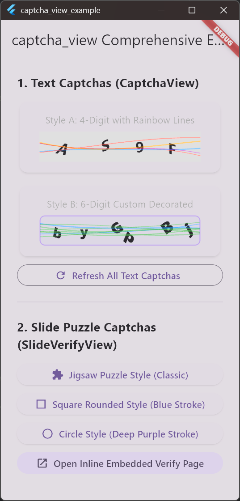
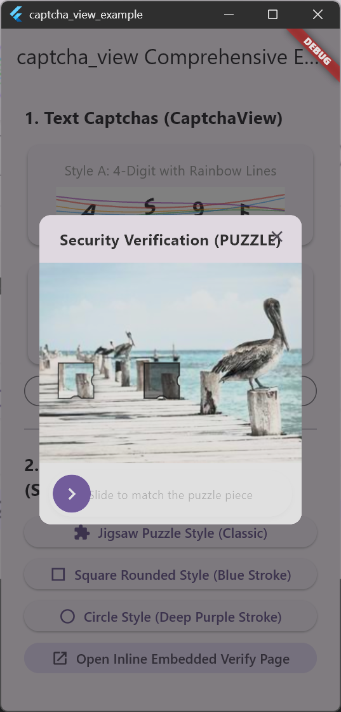
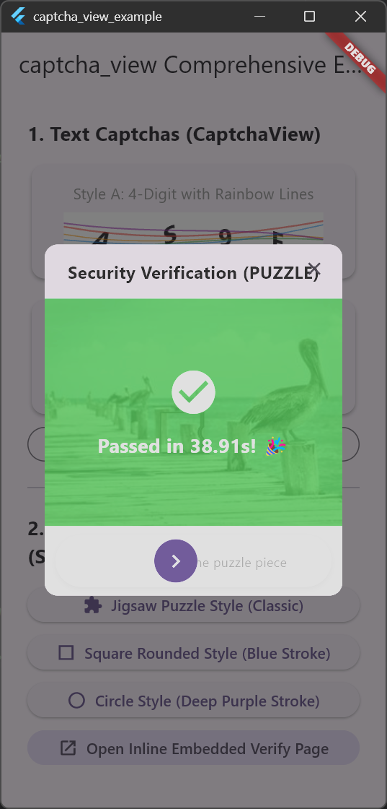
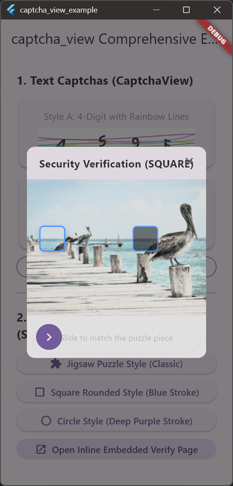
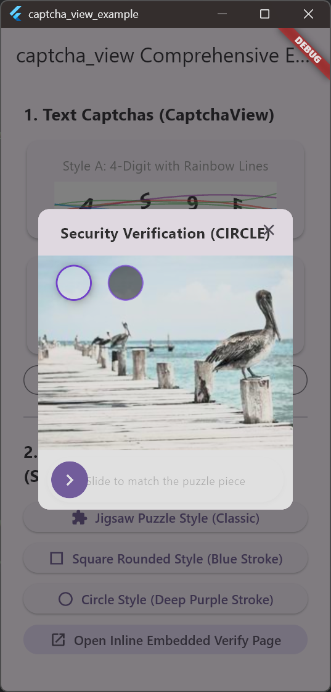
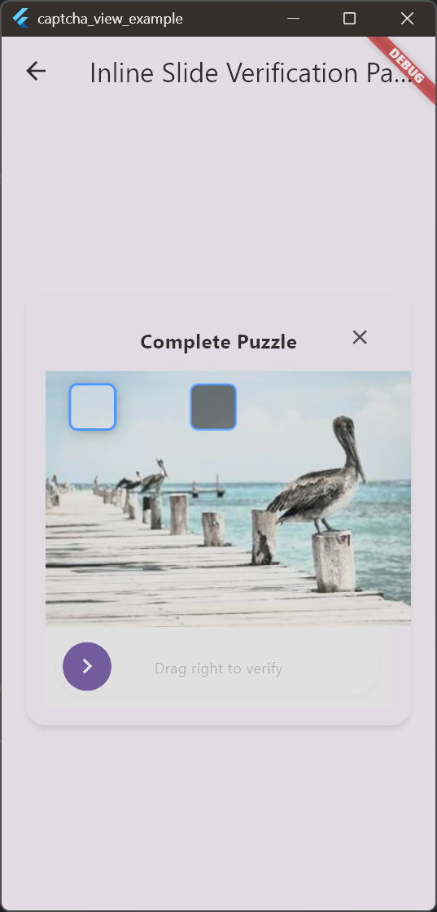

# captcha_view

[](https://pub.dev/packages/captcha_view)
[](https://pub.dev/packages/captcha_view/score)
[](LICENSE)

[English](README.md) | **简体中文**

一个轻量级且高度可定制的 Flutter 人机验证插件，提供抗 OCR 干扰的文字验证码以及交互流畅的滑动拼图验证码。

## 特性

- **文字验证码 (`CaptchaView`)**: 随机生成字母和数字，支持字符倾斜扭曲变形以及平滑的贝塞尔曲线安全水印干扰线，有效防止 OCR 爬虫。
- **滑动拼图验证码 (`SlideVerifyView`)**: 交互流畅的拖拽拼图验证组件，支持弹窗对话框、路由页面跳转及自定义回调。
- **纯代码矢量拼图样式 (`PuzzleStyle`)**: 无需任何外部资产图片文件，动态渲染多种拼图形状（`puzzle` 经典拼图、`square` 圆角正方形、`circle` 圆形）。
- **自定义图片支持**: 支持传入任意 `ImageProvider`（如 `NetworkImage`、`AssetImage` 等）作为拼图背景。
- **自定义描边与阴影**: 可自由调节拼图块描边颜色、宽度以及逼真的 3D 浮动阴影。
- **便捷的一行代码弹窗**: 提供极简的 `SlideVerifyView.show(context)` 静态弹窗方法。

---

## 预览与效果展示

| 整体预览 | 经典拼图样式 | 圆角正方形样式 |
| :---: | :---: | :---: |
|  |  |  |

| 圆形样式 | 自定义样式 1 | 自定义样式 2 |
| :---: | :---: | :---: |
|  |  |  |

---

## 安装

在你的 `pubspec.yaml` 中添加 `captcha_view` 依赖：

```yaml
dependencies:
  captcha_view: ^1.0.0
```

或通过命令行运行：

```bash
flutter pub add captcha_view
```

然后在代码中导入：

```dart
import 'package:captcha_view/captcha_view.dart';
```

---

## 使用指南

### 1. 文字验证码 (`CaptchaView`)

#### 基本用法

使用 `CaptchaView.generateText` 生成随机字符并显示：

```dart
CaptchaView(
  text: CaptchaView.generateText(length: 6),
)
```

#### 点击刷新与排除易混淆字符

支持点击验证码刷新文本，并可配置自动排除容易混淆的字符（`0`、`O`、`1`、`I`、`l`）：

```dart
String captchaText = CaptchaView.generateText(
  length: 6,
  excludeSimilar: true,
);

CaptchaView(
  text: captchaText,
  lineColors: CaptchaView.rainbowColors,
  onTap: () {
    setState(() {
      captchaText = CaptchaView.generateText(
        length: 6,
        excludeSimilar: true,
      );
    });
  },
)
```

#### 自定义样式与容器装饰

支持自定义背景、圆角、边框以及干扰线数量：

```dart
CaptchaView(
  text: CaptchaView.generateText(length: 4),
  lineColors: [Colors.blue, Colors.purple, Colors.red],
  lineCount: 4,
  width: 200,
  height: 50,
  style: const TextStyle(
    fontSize: 22,
    fontWeight: FontWeight.bold,
    letterSpacing: 2,
  ),
  decoration: BoxDecoration(
    color: Colors.grey.shade100,
    borderRadius: BorderRadius.circular(12),
    border: Border.all(color: Colors.deepPurple.shade200),
  ),
)
```

---

### 2. 滑动拼图验证码 (`SlideVerifyView`)

#### 弹窗对话框形式

通过一行代码即可调起全功能滑动拼图验证弹窗：

```dart
final verified = await SlideVerifyView.show(
  context,
  title: '安全验证',
  sliderText: '请向右滑动完成拼图',
  imageProvider: const NetworkImage('https://picsum.photos/300/210'),
  puzzleStyle: PuzzleStyle.puzzle,
  puzzleStrokeColor: Colors.black54,
  puzzleStrokeWidth: 1.5,
  onSuccess: (elapsedSeconds) {
    print('验证成功，耗时 $elapsedSeconds 秒');
  },
);

if (verified == true) {
  // 验证通过
}
```

#### 作为页面路由或普通组件嵌入

你可以将 `SlideVerifyView` 直接推入导航栈或嵌入在任意 Widget 树中：

```dart
final verified = await Navigator.of(context).push<bool>(
  MaterialPageRoute(
    builder: (_) => Scaffold(
      appBar: AppBar(title: const Text('身份验证')),
      body: Center(
        child: SlideVerifyView(
          title: '请完成拼图验证',
          sliderText: '拖动滑块完成拼图',
          imageProvider: const NetworkImage('https://picsum.photos/300/210'),
          puzzleStyle: PuzzleStyle.square,
        ),
      ),
    ),
  ),
);
```

---

## 拼图样式与参数配置

`SlideVerifyView` 通过 `PuzzleStyle` 提供 3 种灵活的几何形状样式：

### 1. 经典拼图样式 (`PuzzleStyle.puzzle`)
带有突起圆弧标签与凹槽的传统拼图块形状。

```dart
SlideVerifyView(
  imageProvider: NetworkImage('https://picsum.photos/300/210'),
  puzzleStyle: PuzzleStyle.puzzle,
  puzzleStrokeColor: Colors.black87,
  puzzleStrokeWidth: 1.5,
  puzzleSize: 40, // 可选：自定义拼图块大小
)
```

### 2. 圆角正方形样式 (`PuzzleStyle.square`)
现代简洁的圆角矩形拼图形状。

```dart
SlideVerifyView(
  imageProvider: NetworkImage('https://picsum.photos/300/210'),
  puzzleStyle: PuzzleStyle.square,
  puzzleStrokeColor: Colors.blueAccent,
  puzzleStrokeWidth: 2.0,
)
```

### 3. 圆形样式 (`PuzzleStyle.circle`)
干净利落的纯圆形拼图形状。

```dart
SlideVerifyView(
  imageProvider: NetworkImage('https://picsum.photos/300/210'),
  puzzleStyle: PuzzleStyle.circle,
  puzzleStrokeColor: Colors.deepPurple,
  puzzleStrokeWidth: 2.0,
)
```

---

## API 参考

### `CaptchaView`

| 参数 | 类型 | 默认值 | 说明 |
| --- | --- | --- | --- |
| `text` | `String` | `''` | 验证码显示的文本。 |
| `width` | `double` | `double.infinity` | 验证码容器宽度。 |
| `height` | `double` | `40` | 验证码容器高度。 |
| `backgroundColor` | `Color` | `Colors.white` | 背景颜色（若提供 `decoration` 则被覆盖）。 |
| `style` | `TextStyle` | `TextStyle(fontSize: 18)` | 验证码字符文本样式。 |
| `lineColors` | `List<Color>?` | `null` | 干扰线颜色列表（为 `null` 时不绘制干扰线）。 |
| `lineCount` | `int` | `4` | 绘制在文字上方的干扰曲线数量。 |
| `decoration` | `BoxDecoration?` | `null` | 自定义容器装饰。 |
| `onTap` | `VoidCallback?` | `null` | 点击验证码时的回调（通常用于刷新）。 |

#### `CaptchaView.generateText()`

| 参数 | 类型 | 默认值 | 说明 |
| --- | --- | --- | --- |
| `length` | `int` | `4` | 生成的字符长度。 |
| `withNumber` | `bool` | `true` | 是否包含数字 (`0-9`)。 |
| `withLetter` | `bool` | `true` | 是否包含字母 (`A-Z`, `a-z`)。 |
| `excludeSimilar` | `bool` | `false` | 是否排除易混淆字符 (`0`, `O`, `o`, `1`, `I`, `l`)。 |
| `customAllowedCharacters` | `String?` | `null` | 自定义允许的字符池字符串。 |

---

### `SlideVerifyView`

| 参数 | 类型 | 默认值 | 说明 |
| --- | --- | --- | --- |
| `imageProvider` | `ImageProvider` | *(必填)* | 背景图片提供器（例如 `NetworkImage`）。 |
| `width` | `int` | `300` | 拼图组件宽度（逻辑像素）。 |
| `title` | `String` | `'Please complete the verification'` | 顶部标题文本。 |
| `sliderText` | `String` | `'Slide to complete the puzzle'` | 滑块轨道上的提示文本。 |
| `puzzleStyle` | `PuzzleStyle` | `PuzzleStyle.puzzle` | 拼图形状样式 (`puzzle`, `square`, `circle`)。 |
| `puzzleSize` | `int?` | `null` | 拼图块的宽高尺寸（逻辑像素）。 |
| `puzzleStrokeColor` | `Color` | `Colors.black` | 拼图块边缘描边颜色。 |
| `puzzleStrokeWidth` | `double` | `1.5` | 拼图块边缘描边宽度。 |
| `successTextBuilder` | `String Function(double)?` | `null` | 验证成功遮罩层的自定义文案生成器。 |
| `showCloseButton` | `bool` | `true` | 是否显示右上角关闭按钮。 |
| `tolerance` | `double` | `5.0` | 目标位置匹配容差（逻辑像素）。 |
| `autoDismiss` | `bool` | `true` | 验证成功后是否自动关闭弹窗/路由。 |
| `autoDismissDelay` | `Duration` | `1 second` | 验证成功后的自动关闭延迟时间。 |
| `onSuccess` | `ValueChanged<double>?` | `null` | 验证成功回调（返回耗时秒数）。 |
| `onFail` | `VoidCallback?` | `null` | 验证失败（滑块松开位置错误）回调。 |
| `onClose` | `VoidCallback?` | `null` | 点击关闭按钮时的回调。 |

---

## 许可证

本项目采用 **MIT 许可证** - 详情请参阅 [LICENSE](LICENSE) 文件。
